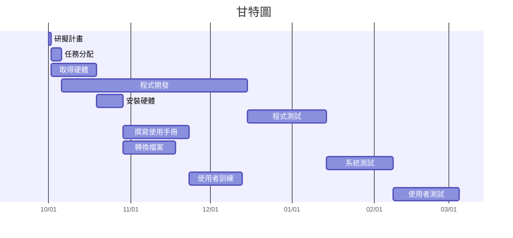

| 任務 | 說明 | 需時（天） | 前置任務 |
|------|------|----------|----------|
| 1 | 研擬計畫 | 1 | - |
| 2 | 任務分配 | 4 | 1 |
| 3 | 取得硬體 | 17 | 1 |
| 4 | 程式開發 | 70 | 2 |
| 5 | 安裝硬體| 10 | 3 |
| 6 | 程式測試 | 30 | 4 |
| 7 | 撰寫使用手冊 | 25 | 5 |
| 8 | 轉換檔案 | 20 | 5 | 
| 9 | 系統測試 | 25 | 6 |
| 10 | 使用者訓練 | 20 | 7,8 |
| 11 | 使用者測試 | 25 | 9,10 |





```mermaid
flowchart LR
    A["研擬計畫<br/>(2025-10-01 - 2025-10-02)"]
    B["任務分配<br/>(2025-10-02 - 2025-10-06)"]
    C["取得硬體<br/>(2025-10-02 - 2025-10-19)"]
    D["程式開發<br/>(2025-10-06 - 2025-12-25)"]
    E["安裝硬體<br/>(2025-10-19 - 2025-10-29)"]
    F["程式測試<br/>(2025-12-15 - 2026-01-14)"]
    G["撰寫是用手冊<br/>(2025-10-29 - 2025-11-24)"]
    H["轉換檔案<br/>(2025-10-29 - 2025-11-19)"]
    I["系統測試<br/>(2026-01-14 - 2026-02-08)"]
    J["使用者訓練<br/>(2025-11-23 - 2025-12-13)"]
    K["使用者測試<br/>(2026-02-08 - 2026-03-05)"]
    

    A -->|FS| B
    A -->|FS| C
    B -->|FS| D
    C -->|FS| E
    D -->|FS| F
    E -->|FS| G
    E -->|FS| H
    F -->|FS| I
    G -->|FS| J
    H -->|FS| J
    I -->|FS| K
    J -->|FS| K
